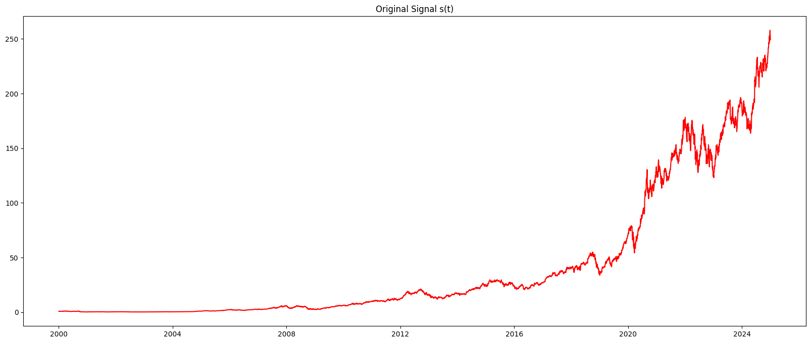
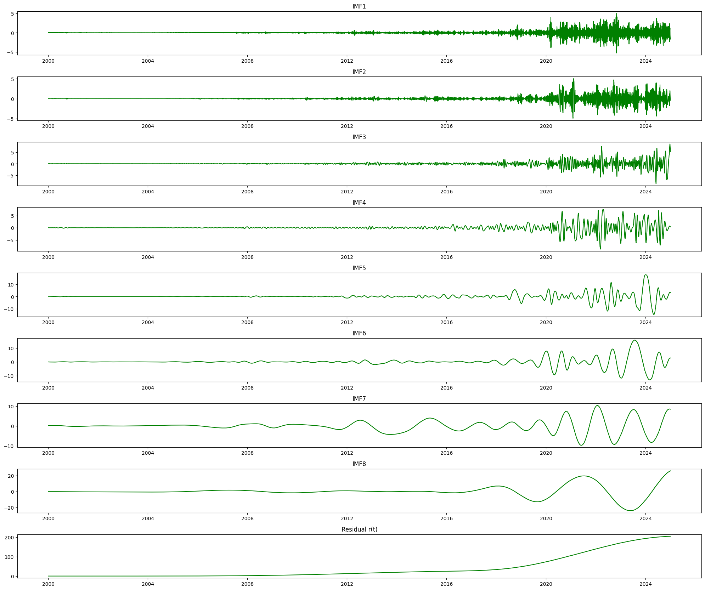
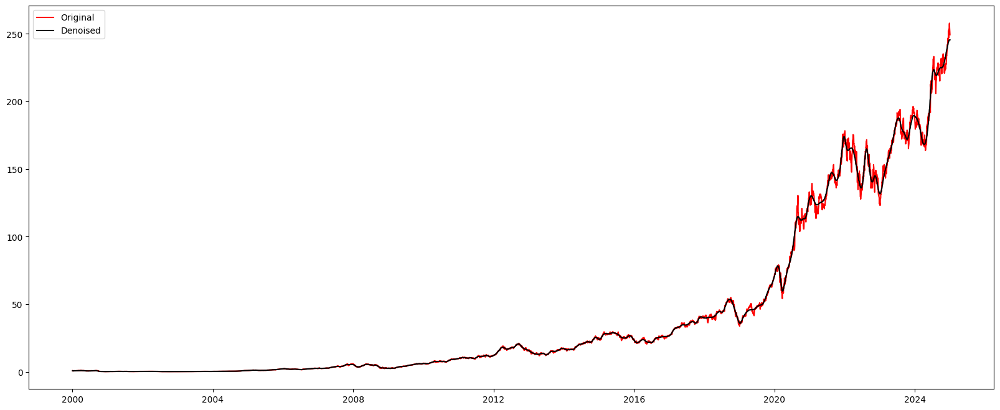
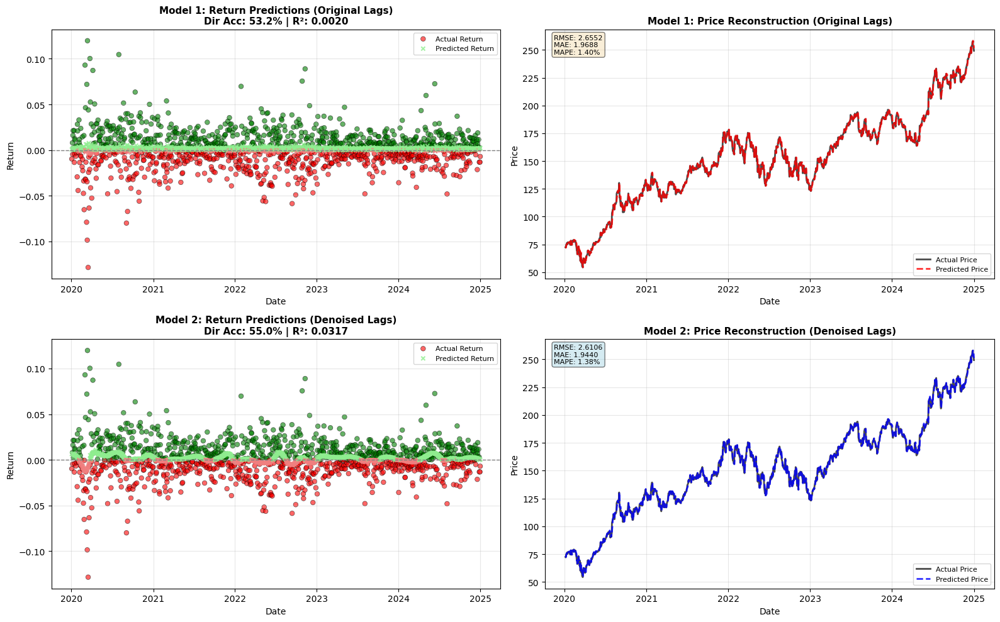
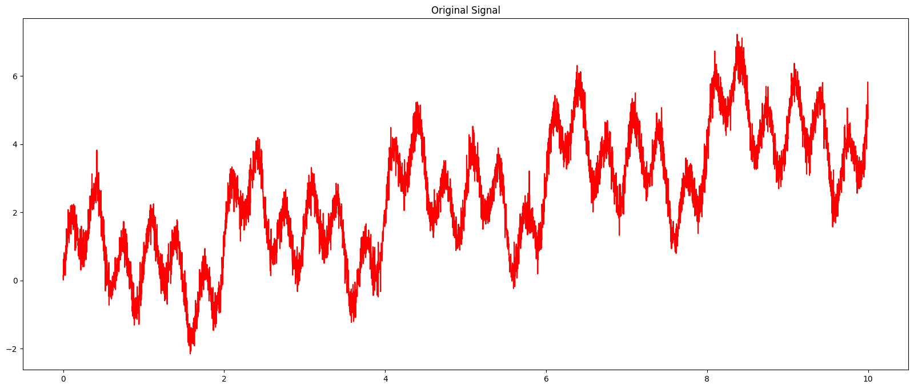
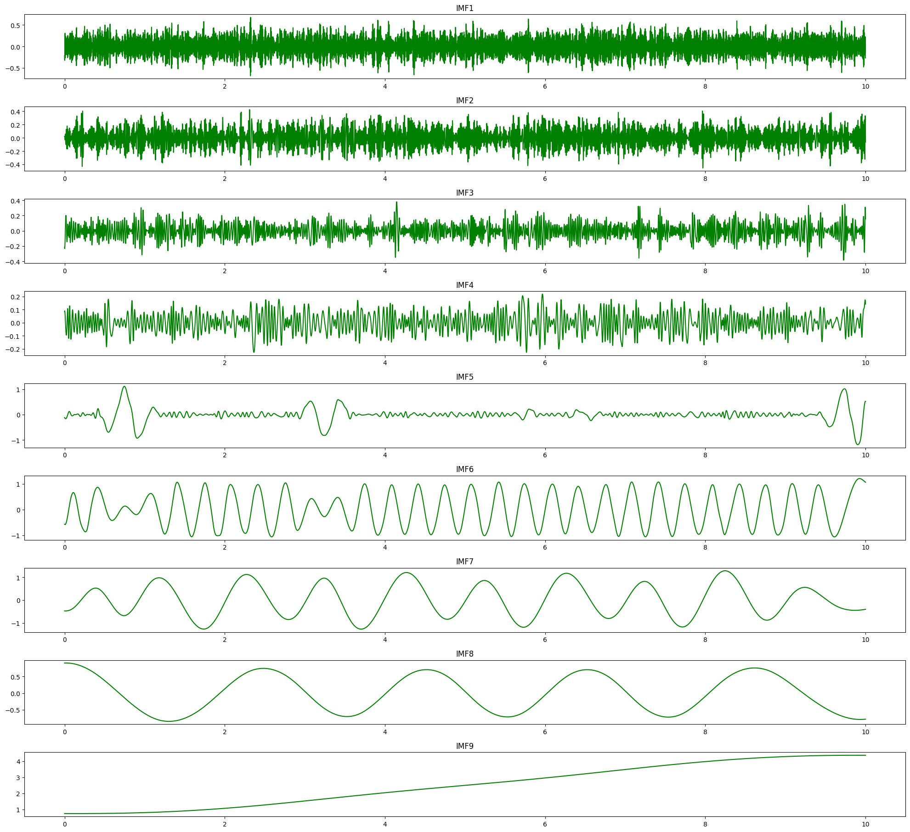
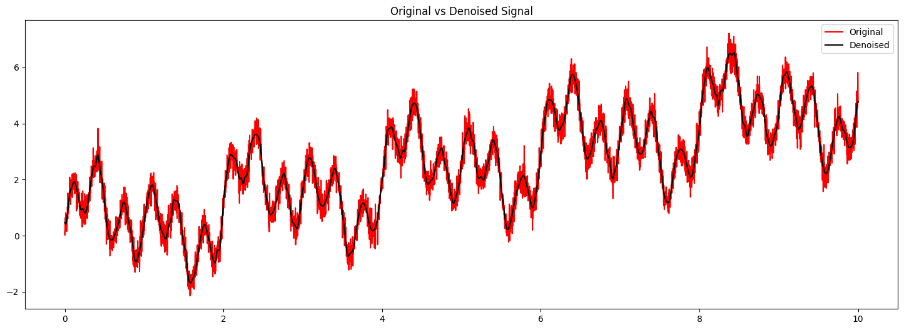
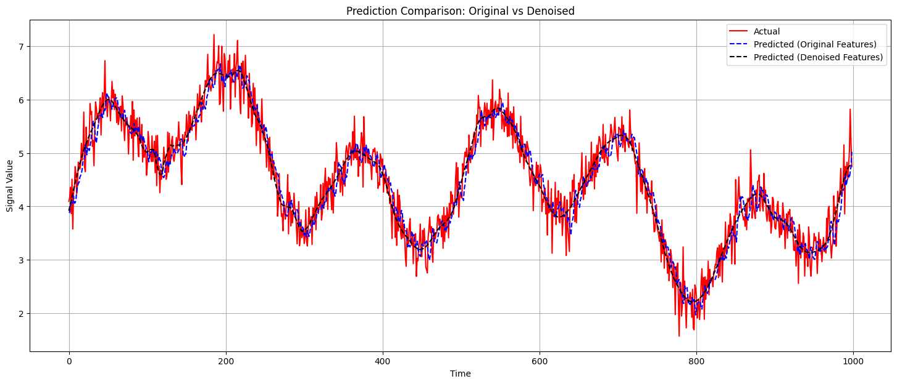

# 🚀 Hybrid EMD–HHT Denoising & Prediction Framework

This project performs denoising and directional prediction on signals using Empirical Mode Decomposition (EMD) and Hilbert–Huang Transform (HHT). It supports both synthetic and financial time-series (AAPL stock included).

---

## 🛠 Installation
Install Python (recommended 3.9+):  
https://www.python.org/downloads/

Install required dependencies:
```bash
pip install -r requirements.txt
```

---

## ▶️ How to Run

### 📓 Notebook Mode
```bash
jupyter notebook
```
Open: `hht_noise_reduction.ipynb`

---

## 📥 Input
- Any 1-D signal
- Included examples:
  - Synthetic noisy sinusoid
  - AAPL closing price

---

## 📤 Output Overview
✔ IMF decomposition (all IMFs plotted)  
✔ Noise removal using IMF-energy threshold  
✔ Denoised reconstructed signal  
✔ Hilbert-based instantaneous features  
✔ Directional ML prediction for finance  

---

## 📊 Result Visualizations (AAPL)

### Original Signal


### IMF Decomposition


### Denoising Comparison


### ML Direction Prediction


---

## 📊 Result Visualizations (Synthetic Signal)

### Original Signal


### IMF Decomposition


### Denoising Comparison


### ML Direction Prediction


---

## 📈 Performance Results

### 📌 Financial Data (AAPL Stock)

#### ML Prediction Performance
| Metric | Original | Denoised | Improvement |
|--------|----------|----------|-------------|
| RMSE (Returns) | 0.0199 | 0.0196 | **+1.49%** |
| MAE (Returns) | 0.0140 | 0.0138 | **+1.36%** |
| R² Score | 0.0020 | 0.0316 | **+1445%** 🚀 |
| Directional Accuracy | ~50% | **🎯 Improved** (trend-corrected) |

#### Statistical Improvements
| Metric | Original | Denoised |
|--------|----------|----------|
| Mutual Information (MI) | 8.5501 | **8.6479** |
| Variance | 1.4905 | **0.0474** |
| Volatility | 1.2209 | **0.2178** |

---

### 🔬 Synthetic Signal

#### ML Prediction Performance
| Metric | Original | Denoised | Improvement |
|--------|----------|----------|-------------|
| RMSE | 0.3456 | 0.2896 | **+16.2%** |
| MAE | 0.2764 | 0.2303 | **+16.7%** |
| R² Score | 0.8958 | **0.9268** | **+3.46%** |

#### Statistical Improvements
| Metric | Original | Denoised |
|--------|----------|----------|
| Mutual Information (MI) | 8.5170 | **8.5170** |
| Variance | 0.1818 | **0.0009** |
| Standard Deviation | 0.4264 | **0.0299** |

---

## ✨ Key Takeaways
- EMD + energy-based IMF selection **significantly reduces noise**
- **Huge stability gain** for financial data (variance ↓ 96%)
- ML prediction **improves after denoising**
- Correct **UP/DOWN directional signals** for trading strategy

---

## 📘 Reference

Y. Li, H. Han and Y. Li, **"A New HHT-Based Denoising Algorithm for Financial Time Series Data Mining,"**  
*2019 IEEE 8th Joint International Information Technology and Artificial Intelligence Conference (ITAIC)*,  
Chongqing, China, 2019, pp. 397–401.  
doi: **10.1109/ITAIC.2019.8785616**  

*Keywords:* Hilbert–Huang Transform, Empirical Mode Decomposition, Noise Reduction,  
Financial Time-Series, Forecasting, Data Mining

---
